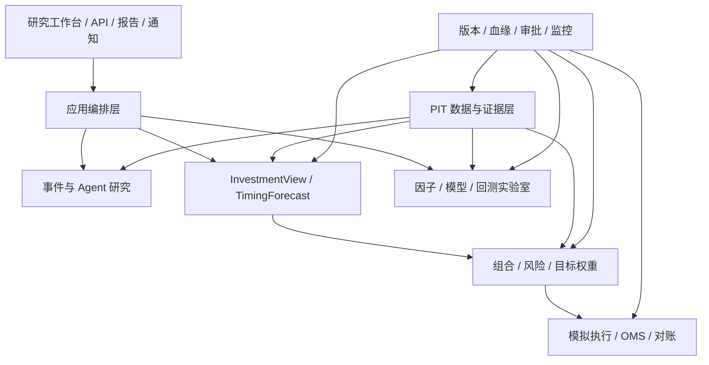

# 目标架构与领域对象

## 1. 总体原则

第一版采用模块化单体，而不是微服务。模块有独立合同和依赖方向，但共享一个部署单元，先把投资语义做对。



## 2. 七个边界上下文

### 2.1 Data & Evidence

负责证券身份、历史股票池、行情、财务、预期、行业、公司行动、公告和原始证据。

核心对象：

- `Company`、`Security`、`Listing`；
- `ClassificationMembership`、`UniverseVersion`；
- `RawObject`、`SourceObservation`、`FactObservation`；
- `DatasetVersion`、`LineageEdge`、`DataQualityResult`。

关键规则：公司、证券和挂牌代码分开；财务事实同时有经济时间、市场可用时间和系统知识时间。

### 2.2 Fundamental Research

负责把原始事实变成可比较特征：

- 通用质量：ROIC、ROE、现金转换、应计、杠杆、盈利稳定性；
- 行业模板：银行看息差和不良，制造看产能/库存/周转，软件看续费/递延收入等；
- 估值与市场预期：相对估值、DCF/剩余收益、隐含增长；
- 改善与恶化：同比/环比、趋势、加速度、预期修正。

核心对象：`FeatureDefinition`、`FeatureSnapshot`、`IndustryTemplateVersion`。

### 2.3 Event Intelligence

负责新闻、公告、研报和供应链事件：

- `Document`：原文、来源、发布时间、抓取时间、hash；
- `Event`：去重后的事实事件；
- `EventClaim`：事实/推断/观点/传闻；
- `ImpactHypothesis`：影响对象、路径、方向、期限、幅度、置信度；
- `SupplyChainEdgeVersion`：有生效区间的上下游关系；
- `EventOutcome`：事后验证结果。

Agent 只生成结构化候选和解释，确定性服务负责时间、实体、数值和权限校验。

### 2.4 Research & Validation

负责因子、Alpha、择时、事件和组合实验：

- `ExperimentSpec` 冻结问题、样本、标签、参数和门槛；
- `ExperimentRun` 绑定数据、代码、环境和结果；
- `FactorVersion`、`AlphaModelVersion`、`TimingModelVersion`；
- `ValidationReport` 记录每个科学门的 pass/fail/waived。

失败实验同样登记，防止只看成功结果。

### 2.5 Decision Compiler

把前四个公司问题编译成 `InvestmentView`，把市场预测编译成 `TimingForecast`。

`InvestmentView` 必须包含：

- 标的与决策时点；
- 预测期限；
- 预期收益点估计与区间；
- 下行风险；
- 质量、估值、改善、事件分项；
- 置信度、催化剂、失效条件；
- 数据、模型和证据版本。

`TimingForecast` 必须包含：

- 预测对象（如中证全指或沪深 300）；
- 1/5/20/60 日收益分布与上涨概率；
- 波动、回撤或尾部风险预测；
- 被动基线仓位、主动调整和最终建议区间；
- Shadow/Research/Production 状态。

### 2.6 Portfolio & Risk

输入只能是冻结的 InvestmentView、TimingForecast、风险模型和成本模型，输出 `TargetPortfolioSnapshot`。

R0 风险层先实现：

- 行业、Size、Beta 暴露；
- 收缩协方差；
- 单股/行业/换手/流动性约束；
- benchmark-relative 与 absolute 两套风险视图；
- 等权基线和受约束优化对照。

R1 再自建 A 股风格风险模型，R2 才接商业或外部模型做对照。

### 2.7 Execution & Learning

OMS 与研究隔离：

- `OrderIntent` → 风控 → 审批 → `BrokerOrder` → `Fill`；
- 幂等 key、防重复下单、状态机、拒单原因；
- A 股 T+1 库存、整手、停牌、涨跌停、费用和公司行动；
- 持仓、现金、订单和成交四方对账；
- 收益、风险、选股、择时、事件、成本和执行归因闭合。

## 3. 数据可信状态

```text
raw
  原始抓取，未标准化

normalized_current
  可用于今天的研究，但未证明历史可用时间

pit_verified
  公告/来源、available_at、修订和系统时间已验证，可进入严格历史研究
```

可信状态只能由数据治理流程提升，不能由 Agent、前端或模型自行提升。

## 4. 科学验证矩阵

| 研究类型 | 回答的问题 | 最低数学/统计检验 |
|---|---|---|
| 数据/PIT | 当时是否真的可见 | 泄漏断言、修订重放、历史池/退市覆盖、缺失与异常分布 |
| 单因子 | 因子与未来收益是否有关 | IC/Rank IC、HAC t 或 block bootstrap CI、分层单调、衰减、换手、行业/Size 中性、Fama–MacBeth、多重检验、样本外 |
| 多因子/选股 | 组合是否有增量收益 | Walk-forward、purged/embargo、基线比较、bootstrap CI、参数稳定、子期间/状态、成本和容量 |
| 主动择时 | 是否比静态仓位更好 | AUC/平衡准确率、Brier/log loss、校准曲线、HAC、Diebold–Mariano（适用时）、成本后效用、静态/波动率基线 |
| 事件 | 事件是否改变价格路径 | 市场/行业/因子调整异常收益、AR/CAR、事件窗、clustered SE、匹配样本、重叠事件和多重检验 |
| 组合 | 权重规则是否有效 | Alpha/Beta、Sharpe/Sortino/Calmar、最大回撤、TE/IR、风险贡献、压力、PSR/DSR、换手与容量 |
| 执行 | 模拟是否接近现实 | 成交率、滑点预测误差、implementation shortfall、费用归因、拒单/涨跌停/停牌压力 |

统计显著不等于可投资；经济显著不等于可成交。两类门必须同时通过。

## 5. 回测类型不能混淆

| 名称 | 回测什么 | 输出 |
|---|---|---|
| 数据重放测试 | 历史时点可见的数据版本 | 泄漏/覆盖报告 |
| 因子回测 | 截面因子值与未来收益关系 | IC、分层收益、衰减、统计不确定性 |
| 选股策略回测 | 排名、调仓和组合规则 | 资金曲线、超额、风险、成本 |
| 择时回测 | 市场仓位随预测变化 | 相对静态仓位的收益与风险 |
| 事件研究 | 事件窗异常收益 | AR/CAR 与显著性 |
| 执行仿真 | 订单是否能成交、成交多贵 | Fill、滑点、成本、拒单 |
| 报告结果评估 | 当时的文字/结构化预测是否命中 | 准确率、校准、方向收益；不是组合回测 |
| 实盘 replay | 生产信号、订单和成交能否重放 | 对账与归因一致性 |

## 6. 存储和技术栈

V1 建议：

- PostgreSQL：身份、PIT 事实、元数据、版本、运行、审批、OMS；
- Parquet + DuckDB/Polars：价格、特征、标签和回测面板；
- S3/MinIO 兼容对象存储：原始文件、公告、模型和实验产物；
- FastAPI：应用 API；
- React/TypeScript：研究工作台；
- worker + scheduler：摄取、计算、回测、Shadow 和发布。

第一版可以本地 PostgreSQL + 文件系统对象存储运行，合同不绑定具体基础设施。

## 7. 外部仓库边界

- Qlib：模型训练、实验和 Recorder 适配器，不做权威数据源；
- Alphalens/Empyrical/QuantStats：指标交叉检查，不做生产真源；
- statsmodels/linearmodels/arch：统计推断；
- cvxpy：组合优化；
- RQAlpha 或 LEAN：与内部 A 股领域回测器做双引擎对照；
- DSA：产品体验和 Agent/报告供体，不成为数据权威；
- Legacy：领域合同供体，不直接作为新平台运行时依赖。

