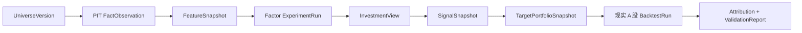

# 第一条黄金链路

## 目标问题

> 基于历史当时可知的基本面信息，A 股多头选股在现实交易规则和成本之后是否成立？

## 最小范围

- 市场：A 股；
- 方向：多头；
- 股票池：先选一个历史成员可获得且包含退市样本的明确池；
- 频率：月度或财报后再平衡；
- 期限：20/60 个交易日；
- 因子：质量、估值预期差、改善；
- 组合：Top-N 等权作为第一基线；
- 择时：同时记录主动 Shadow，但第一条选股归因保持可分离；
- 事件：第一阶段只保存财报公告和重大正式公告的 PIT 文档/证据，不先做全网情绪，也不在 P8 前把它伪装成已量化的 event adjustment。

## 端到端对象流

## 第一批验收 fixture

至少准备：

- 正常年报；
- 盘后公告，下一交易日才可用；
- 财报更正，旧版本在更正日前仍可见；
- 停牌；
- 一字涨停买不到；
- 跌停卖不出；
- T+1 当日买入不可卖；
- 分红送转；
- ST 状态变化；
- 退市终值；
- 行业分类变化；
- 代码或挂牌变化。

## 最小对照组

每个复杂模型都必须和以下基线比较：

1. 可投资股票池等权；
2. 行业内随机 Top-N 的重复模拟；
3. 单一简单价值因子；
4. 三因子简单等权；
5. 不做主动择时的静态股票仓位。

## 完成而非“看起来完成”的标准

- 所有输入都有 version/hash/as-of；
- 任意一条因子值可追到当时可用财务事实；
- 任意一笔交易能解释为何成交或被阻塞；
- 统计报告含不确定性和多重检验，不只展示收益曲线；
- 结果同时展示成本前、成本后和相对基准；
- 失败实验不会消失；
- 同一信号经内部与外部引擎差异可解释；
- 如果结果不成立，平台能明确给出“不成立”，而不是调整口径隐藏失败。
