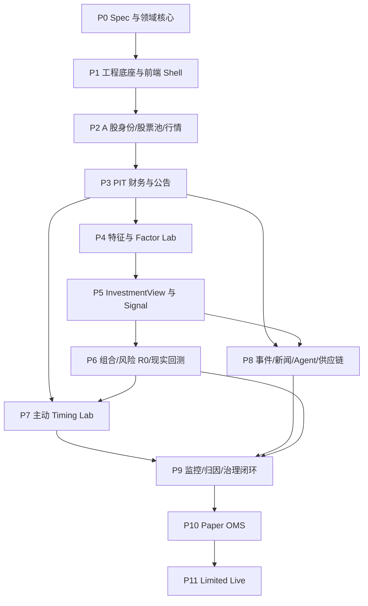

# A 股基本面量化平台详细实施 Plan

> 文档状态：Draft for User Review
>
> 版本：0.9.2
>
> 日期：2026-08-15
>
> 需求真源：`07-detailed-system-spec.md`
>
> 执行原则：按 Gate 交付，不按代码量或页面数量宣布完成

## 0. Plan 的用途

本文把 Spec 转换成可执行工作包、依赖、交付物、测试和 Gate。它不替代 Spec，不允许在实现时偷偷降低 Spec。

任务状态只有：

- `not_started`；
- `in_progress`；
- `blocked`；
- `done`。

`done` 要求代码、测试、文档、真实或明确 fixture 证据同时存在。

阶段 Gate 分成两类：

- Capability Gate：系统能力实现正确，允许研究结果诚实为负；
- Promotion Gate：具体对象通过统计、治理和用途审批，才允许进入 Shadow/Paper/Live。

一个因子或主动 Timing 模型没有通过 Promotion Gate，不应阻塞平台把研究、拒绝、监控和回滚流程做正确；它只会保持在原生命周期，不能影响更高部署阶段。

## 1. 执行纪律

### 1.1 来源仓库纪律

- `sources/daily_stock_analysis` 和 `sources/legacy_quant_platform` 始终只读；
- 用户原工作树 `/Users/macbook/agent-agnostic-stock-skills-clean` 始终只读，尤其不能覆盖其未提交前端；
- 迁移代码前记录 source path、commit、license、修改和目标测试；
- 优先重写小领域合同和 adapter，不复制整个目录。

### 1.2 TDD 与证据

每个工作包按顺序执行：

1. 写/更新合同和验收 fixture；
2. 先形成失败测试或缺口证据；
3. 最小实现；
4. 单元、集成和合同测试；
5. 真实小样本验证；
6. 更新 coverage、lineage 和 limitation；
7. Gate 审查。

金融数值必须有手工核算样例。统计结果必须用至少一个独立库或外部引擎交叉检查。

### 1.3 分支与提交建议

用户确认本 Plan 后再初始化/确定 Git 策略。建议每个工作包一个短分支或一组语义清晰提交；不把数据、前端、回测和 Agent 的大改动塞进一个 diff。

## 2. 总体依赖图



前端不是最后一次性建设。P1 建 Shell 和诚实空状态，P2–P10 随领域能力逐步接真实 API。
从 2026-08-15 起另设跨阶段 PUI 轨道，把 Figma/原型落实为运行时产品；它与数据/Gate 工作并行，
但不能绕过任何领域、PIT、科学、审批或权限依赖。详见
`docs/plans/track-00-prototype-runtime-delivery.md`。

## 3. 工作轨道

| Track | 内容 | 长期 owner 边界 |
|---|---|---|
| T-A Domain | 身份、PIT、研究、决策、组合、执行对象 | 不依赖框架 |
| T-B Data | Provider、ODS、PIT 仓库、质量、血缘 | 不产生投资结论 |
| T-C Research | 特征、统计、模型、回测、Timing/Event Study | 不发送订单 |
| T-D Product | FastAPI、原型驱动前端、任务、报告、通知 | 不提升 trust state，不用视觉完成替代 Capability |
| T-E Execution | 风险、OMS、Broker、对账 | 不读取非获批研究输出 |
| T-F Governance | 版本、审批、监控、安全、SLO | 跨域但不绕过域规则 |

### 3.1 T-D/PUI 原型运行时轨道

T-D 不再只在每个阶段末尾追加一个通用页面。它按
`docs/plans/track-00-prototype-runtime-delivery.md` 维护独立的 PUI-00–PUI-09 工作包，并逐页记录：

- Design Parity；
- Runtime Product 六态；
- Domain/Capability。

当前事实为：31 个页面位中约 12 个只有局部合同/API 接线，19 个仍是占位，0 个完成精确 Figma node
的运行时视觉一致性验收。P5 四视口浏览器通过只证明当前 empty/unavailable 状态的响应式、网络和
控制台合同，不能写成原型 parity。当前差距证据见 `docs/22-prototype-runtime-gap-audit.md`。

近期允许两条独立 work package 并行：

1. Data/Gate：Step 02 Task 1 strict-PIT 数据源资格探针；
2. Product/PUI：PUI-00 设计基线恢复，随后 PUI-01 Desk 与 PUI-02/PUI-03 P5 黄金路径。

两条线必须分开测试、Evidence 和提交；缺真实数据时 PUI runtime 保持真实
`empty/partial/unavailable/blocked`，不得导入 DESIGN FIXTURE。

## 4. P0：Spec、审计与核心合同

状态：`in_progress`，本轮完成主体，等待用户审查。

覆盖：SPEC-001–009、020、024、041、053、058。

### P0-W01：来源冻结与审计

已完成：

- 创建隔离目录；
- 克隆两个来源已提交基线；
- 保存 commit；
- 证明两个 donor 工作树干净；
- 记录 DSA 回测、PIT、筛选、Agent 和前端边界；
- 记录 legacy 的 PIT、版本、因子、Signal、组合和现实回测资产。

Gate 证据：`01-donor-audit.md`、`03-migration-map.md`、ADR-0001。

### P0-W02：时间、可信和修订合同

已实现：

- `DataTrustState`；
- `DataMode = current_research | strict_historical`；
- 独立的 `DeploymentStage` 和 `RunContext`；
- 双轴组合 fail-closed（`strict_historical` 仅允许 `research`）；
- timezone-aware `FactObservation`；
- 双时间可见性；
- strict/current 资格；
- 修订日前旧值、修订后新值；
- 重复最高修订 fail-closed。

剩余：

- [ ] 引入 unit/currency/provider/source field；
- [ ] 支持同一事实多供应商观察与权威选值；
- [ ] property-based 时间边界测试；
- [ ] 序列化和 schema version。

### P0-W03：InvestmentView 与验证门

已实现：

- 预期收益分布；
- 分项贡献、证据和版本；
- invalidators；
- 四态 `InvestmentComponent`；
- 仅 `quantified` 分项参与数值闭合；
- 显式 residual 闭合；
- factor/stock selection/timing/event/portfolio/execution 验证政策。

剩余：

- [ ] downside/tail risk；
- [ ] catalyst；
- [ ] Feature/Model/Run 强类型引用；
- [ ] ValidationResult 与 waiver/approval 对象。

### Gate P0

- [ ] 用户批准 Spec；
- [ ] 用户批准 Plan；
- [ ] 一致性审查无 unresolved blocker；
- [x] 新核心测试通过；
- [x] 来源仓库未修改。

当前核心合同验证命令（`PYTHON_BIN` 必须指向 Python 3.11+）：

```bash
cd platform
PYTHON_BIN="${PYTHON_BIN:-python3.11}"
"$PYTHON_BIN" -c 'import sys; assert sys.version_info >= (3, 11), sys.version'
PYTHONPATH=src "$PYTHON_BIN" -m unittest discover -s tests -v
PYTHONPYCACHEPREFIX=/tmp/a-share-platform-pycache "$PYTHON_BIN" -m compileall -q src
```

P0 Gate 未由用户批准前，不进入大规模实现。

## 5. P1：工程底座、设计系统和应用 Shell

依赖：P0。

覆盖：SPEC-008–009、004–005（最小服务端权限骨架）、041–046、049–058。

### P1-W01：项目结构与依赖守卫

任务：

- [x] 确定 package layout：`domain/application/ports/adapters/api/workers`；
- [x] PostgreSQL、对象存储和 Parquet 的本地配置；
- [x] migration runner；
- [x] settings 和 secret loading；
- [x] domain dependency lint；
- [x] structured logging、trace_id/run_id；
- [x] CI：Python、类型、lint、test、migration、frontend build；
- [x] dev/test/prod 配置隔离。

交付：`compose.yaml`、migration 0001、CI、Architecture Test。

### P1-W02：版本、运行和 Artifact 最小账本

任务：

- [x] `DatasetVersion`；
- [x] `RunRecord`；
- [x] `Artifact`；
- [x] `LineageEdge`；
- [x] immutable content hash；
- [x] run 状态机和失败原因；
- [x] API 响应统一 context envelope。

测试：重复写幂等、hash 冲突、失败保留、版本不可覆盖。

### P1-W03：前端设计系统迁移

来源：用户原工作树最新 `tokens.less`、`global.less`、`NumericCell.tsx` 和 Shell 行为；迁移前登记 provenance。

任务：

- [x] React 19/Vite 7/AntD 6/ProTable/TanStack Query/Zustand/Less/Recharts；
- [x] 迁移 `#2F5EA8` 冷调蓝灰 token；
- [x] 3px 圆角、无阴影、高密度表格；
- [x] 数据质量/审批/涨跌/严重度四组语义色；
- [x] `NumericCell`；
- [x] `PageHeading`、`WorkspaceUnavailable`、`EvidenceDrawer`；
- [x] loading/error/empty/blocked/ready 五态组件；
- [x] 320/768/1024/1440 responsive contract。

禁止：复制原工作树未提交代码而不记录来源；引入另一套设计系统。

### P1-W04：六项导航和全局上下文

任务：

- [x] `/desk /research /factors /portfolios /monitoring /system`；
- [x] 280/72 desktop sidebar；
- [x] mobile Drawer；
- [x] 全局证券搜索；
- [x] as_of/system_as_of；
- [x] 分离的 `data_mode = current_research/strict_historical`；
- [x] 分离的 `deployment_stage = research/shadow/paper/limited_live`；
- [x] 非法组合由服务端拒绝；
- [x] Universe/Portfolio context；
- [x] 环境和只读/交易状态；
- [x] 旧路由 redirect；
- [x] URL query 保存筛选/排序；
- [x] 不默认选择 fixture 股票。

### P1-W05：FastAPI 只读骨架

任务：

- [x] health/version/capability；
- [x] dataset/run/artifact read API；
- [x] context envelope；
- [x] problem details 错误；
- [x] OpenAPI 与前端 type generation；
- [x] anonymous read-only 默认；写入口先关闭；
- [x] AuthN/AuthZ ports、服务端 permission policy 和审计主体合同；
- [x] Viewer/Researcher/Reviewer/Data Operator/PM/Trader/Admin/Agent 的 deny-by-default 矩阵测试；
- [x] 不把前端隐藏、本地字符串或请求 header 冒充可信身份。

### Gate P1

状态（2026-08-10）：Capability Gate 已通过。实现、迁移、TDD、浏览器矩阵和限制证据见 `docs/10-p1-implementation-evidence.md`。此状态不代表任何模型科学有效，也不授予真实交易能力。

- 单元/集成/前端/构建通过；
- 六项导航和最新机构视觉通过视觉回归；
- 所有未接 API 显示具体 unavailable 原因，无生产假数据；
- migration 从空库可重放；
- domain 不依赖 Web/DB/provider；
- 数据模式和部署阶段分轴，非法提升被拒绝；
- 匿名、Researcher 和 Agent 的越权负向测试通过；
- Spec：SPEC-042–046、051、053、057–058 通过。

## 6. P2：A 股身份、历史股票池、行情和交易状态

依赖：P1。

覆盖：SPEC-010–012、014–015、031、034 的市场规则基础。

### P2-W01：Data Source Spike 与 ADR

任务：

- [x] 对候选来源评估字段、2018+ 历史、公告时间、修订、退市、许可、稳定性、价格；
- [x] 明确免费原型源与未来实盘源的不同资格；
- [x] 定义 Provider Registry 和字段权限；
- [x] 选择第一主源、备用源、交易所权威源；
- [x] 写 ADR 和 coverage matrix。

Gate：没有来源/许可决策，不开始批量历史回填。

### P2-W02：Security Master

任务：

- [x] Company/Security/Listing schema；
- [x] SH/SZ/BJ 和板块；
- [x] 名称、代码、上市/退市历史；
- [x] ST、暂停上市、终止上市；
- [x] 行业分类 membership 有效区间；
- [x] 公司/证券/挂牌映射 API；
- [x] 代码变化和多证券 fixture。

### P2-W03：历史 Universe

任务：

- [x] UniverseDefinition/Version/Membership；
- [x] research eligible 与 tradable eligible 分离；
- [x] 纳入/排除原因；
- [x] benchmark membership；
- [x] 退市样本覆盖；
- [x] 任意日重建查询；
- [x] Universe diff 和覆盖报告。

### P2-W04：行情、日历、公司行动

任务：

- [x] 原始不复权 OHLCV/amount；
- [x] 复权因子；
- [x] 涨跌停/停牌/ST/listing status；
- [x] 总/流通/自由流通股本；
- [x] 分红、送转、拆股、配股；
- [x] 交易日历和下一可交易 session；
- [x] 数据质量和来源冲突；
- [x] Parquet 分区与查询。

### P2-W05：前端研究入口

- [x] Research → Universe & Screen；
- [x] 历史时点和当前时点切换；
- [x] 成员、原因、状态、行业和版本；
- [x] 数据覆盖表；
- [x] 不可交易/退市明确展示；
- [x] ProTable 列配置和 URL view。

### P2-W06：私人本地真实数据回填

状态：`in_progress`。该工作包补充数据覆盖，不降低 P2/P3 的 PIT 和来源资格标准。

- [x] 独立 `private_local_research` 用途与 retention 明确禁止优先规则；
- [x] 仅 `normalized_current`，禁止 `pit_verified`、strict historical、生产决策和外部分发；
- [x] 显式 symbols/domains、年度 checkpoint、质量/覆盖率和 DatasetVersion；
- [x] BaoStock SDK 沪深 raw 日线/日历 source；
- [x] Futu `OpenQuoteContext` 沪深 raw 日线 source，不含账户或交易能力；
- [x] PostgreSQL + Parquet canonical sink 和恢复测试；
- [x] `--all-a-share` 独立执行门、BaoStock/CNInfo 当前沪深 Security Master 采集与 canonical persistence；
- [x] 显式 symbols 的当前 Security Master 快速路径；只允许 `security_master`，Universe 仍强制 `--all-a-share`；
- [x] 沪深 300/中证 500 每交易日历史快照采集、半开区间压缩与 research-only persistence；
- [ ] 真实 A 股全市场 Security Master 回填；
- [ ] 沪深 300/中证 500 历史 Universe 持久化；
- [ ] 2018+ 股本和公司行动合格来源与入库；
- [x] Data Operator 在确认具体数据条款后执行真实小样本并保存质量/覆盖率证据。

前两项未勾选表示尚未执行真实下载/入库：当前代码能力只覆盖 XSHG/XSHE，XBSE 仍缺；历史成员仍为 `normalized_current`，且在可交易状态未验证前 `tradable_eligible=false`。

状态更新（2026-08-11）：2018 首个历史 Universe 工作单元所需的 53 个仍在市证券身份已全部
通过 BaoStock 状态与 CNInfo 法定身份链补齐；剩余 15 个均为已退市证券，必须取得官方历史
身份后才能继续。2026 CSI300 月末离散 pilot 已保存 8 个观察月末、8 个显式未观测区间和
2,400 条 membership，但仍是 `normalized_current`，不能代替完整历史 Universe 或 PIT。

### Gate P2

状态（2026-08-10）：实现、迁移、自动化测试和真实 HTTP 接线已完成；Capability Gate 暂不宣称通过。浏览器控制当前无可用实例，交付清单要求的 320/768/1024/1440 截图与视觉回归尚待补齐。证据和剩余项见 `docs/12-p2-implementation-evidence.md`。

- 任意选定历史日可返回研究池、可交易池、行业和挂牌；
- 至少包含一个退市、ST、停牌、代码/名称变化案例；
- 原始/复权价格和股本市值抽样核算通过；
- 页面不隐藏退市证券；
- SPEC-010–012 通过。

## 7. P3：PIT 财务、披露和数据证据链

依赖：P2。

覆盖：SPEC-006、013–015、027 的正式公告部分；为 SPEC-018–019 提供数据前提，但不在本阶段宣称估值/改善模块完成。

### P3-W01：RawObject 与官方披露

- [x] 请求/响应/文件不可变保存；
- [x] SHA-256、URL、provider、retrieved_at；
- [x] 巨潮/交易所/公司公告索引；
- [x] publication 和 first tradable availability；
- [x] 文档版本、更正、撤回；
- [x] PDF/HTML 元数据；
- [x] license/retention policy。

### P3-W02：Canonical Metric Registry

- [x] 三表字段 code、名称、单位、币种、符号；
- [x] provider field 显式映射；
- [x] 禁止模糊映射进入生产；
- [x] 映射用途范围显式区分 `current_research`、`strict_historical`、`production`，调用方按
  目标用途 fail closed；AkShare 映射仅允许 `current_research`；
- [x] mapping version；
- [x] 财务平衡/跨表质量规则；
- [x] unmapped queue。

### P3-W03：PIT Financial Repository

- [x] FactObservation 持久化；
- [x] announcement/available/revision/system interval；
- [x] current 与 strict query；
- [x] 同源修订；
- [x] 多源冲突和权威选择；
- [x] backfill 不污染历史；
- [x] lineage 和 quality propagation。

### P3-W04：真实 PIT Fixture Pack

至少包括：

- [x] 正常盘后年报；
- [x] 盘前公告；
- [x] 周末公告；
- [x] 财报更正；
- [x] 同一报告期多版本；
- [x] 单位/币种冲突；
- [x] 缺失字段；
- [x] 一次性项目；
- [x] 供应商值与官方披露不一致。

每个 fixture 保存原始证据和人工期望值。

### P3-W05：前端数据与管理

- [x] Catalog/Quality/Lineage/Jobs；
- [x] Disclosure timeline；
- [x] Fact revision timeline；
- [x] current/strict 对比；
- [x] mismatch queue；
- [x] 原始证据 Drawer；
- [x] coverage 和阻断原因。

状态（2026-08-10）：W05a/W05b 已实现 System 四个只读面板和财务证据诊断。开发库当前
显示 13 个 DatasetVersion、28 份质量报告、19 个 ingestion job 和 55 条 lineage；浏览器
在 `http://127.0.0.1:5173/` 验证了真实五粮液披露/事实修订、Current/Strict 阻断差异、
Mismatch Queue 和只显示治理元数据的 Raw Evidence Drawer。页面没有注入运行时演示值；
证据见 `docs/13-p3-implementation-evidence.md`。

### P3-W06：Timing Shadow Ledger 基础

为了不等 Timing 模型完成才开始积累：

- [x] 定义 TimingForecast immutable schema；
- [x] 每日记录静态满仓与被动波动率基线，标记 `data_mode=current_research`、`deployment_stage=shadow`；
- [x] 保存市场标签未来计算所需 cutoff；
- [x] 只作为 baseline/shadow，不声称主动模型已完成。

状态（2026-08-10）：真实 CSI500 当日 UniverseVersion（500 个有效成员）已绑定；worker
读取 21 个 BaoStock 未复权收盘价，按 20 日对数收益样本标准差乘 `sqrt(244)` 追加首条
`current_research + shadow + normalized_current` baseline。重跑返回 `created=false` 且不再
访问供应商；forecast、bars 均有 UPDATE/DELETE trigger。主动预测继续为 `unavailable`，
P7 前不能影响生产仓位。证据见 `docs/13-p3-implementation-evidence.md`。

### Gate P3

- 修订和双时间查询端到端通过；
- 至少 3–5 家真实公司、两个修订案例；
- PIT leakage suite 通过；
- 页面每个事实可追原文/版本；
- baseline Timing ledger 开始追加且不可修改；
- SPEC-006、013–015、027 的公告部分通过。

状态（2026-08-10）：上述 P3 Capability 条件已有代码、真实小样本、数据库和浏览器证据，
P3 Gate 通过。该判断只证明 P3 证据/双时间/诊断/基线能力，不证明全市场财务覆盖、主动
Timing、任何因子或模型科学有效。P2 的多尺寸浏览器视觉证据、完整历史 Universe、XBSE、
股本和公司行动仍是独立未完成项。

### Gate 后数据扩容（P3.5，不是 P3 Gate 条件）

700–800 家三表不是“不用导入”，正式时点为 P3 Gate 后、P4 大规模科学研究前。该扩容不
倒改 P3 Gate 结论，但 P4 不得在所需公司/报告期覆盖和质量未达标时宣称广覆盖因子研究完成。

- [ ] Factor Service/iFinD/THS 完成新凭证、live metadata、本地批量保存和缓存副作用资格审查；
- [ ] Wind 完成接口、许可、修订和时间语义审查，在此之前保持 candidate；
- [ ] 3–5 家 live 结构化三表 pilot 与官方 PDF 抽样对账；
- [x] AkShare fallback 完成 current-only source profile、映射、checkpoint worker 和本地执行门；
- [x] AkShare 完成 5 家 × 2024 × 三表 live 工程 pilot 与幂等重跑；
- [x] AkShare 完成 CSI300 中 30 家 × 2018–2025 × 三表批次，720/720 工作单元成功；
- [ ] 按 CSI300 → CSI500 分阶段入库，每个工作单元持久化 DatasetVersion、checkpoint、quality、
  coverage 和 lineage；
- [ ] 批量 current 数据保持 `normalized_current`；strict 只从官方版本链和独立治理运行晋升。

已完成的 current-only 身份前提：财务 observation、Dataset manifest 和持久化 receipt 显式保存
`identity_resolution_method=current_known_retrieval_date`，统一按 provider `retrieved_at` 的
UTC 日期解析，并携带“历史报告期身份未获 PIT 验证”warning。该 resolver 只允许进入
`normalized_current + current_research` UoW；严格 effective-dated resolver 保持独立，
current-known 身份不能被 strict/PIT 消费。

映射资格不再使用 `production_allowed` 布尔值代理。P3.5 current worker 必须显式请求
`DataMode.CURRENT_RESEARCH`，只有包含 `current_research` scope 的映射可执行；strict/PIT
事实摄取和 production 使用分别要求对应 scope，任何一个 scope 都不隐含另一个；mapping 的
production scope 仍不能绕过数据可信、Promotion Approval 或 deployment stage 门。

状态更新（2026-08-11）：30 家批次持久化 2,120 条观测、30 个证券、3 张报表、9 个 metric，
报告期覆盖 2018-12-31 至 2025-12-31；720 份 work-unit quality/coverage 与 aggregate
DatasetVersion 均已持久化。利润表实际为 680 条，缺失保持缺失而非填零。该结果仍是
`current_research + normalized_current + pit_verified=false`；它证明 worker、恢复和本地入库
链路可运行，不证明官方 PDF 对账、700–800 家覆盖、strict PIT 或模型科学有效。

## 8. P4：行业模板、特征工程和正式 Factor Lab

依赖：P3。

覆盖：SPEC-016–017、020–023、042–044、048；实现 SPEC-018–019 的特征层，完整估值/改善服务留到 P5。

### P4-W01：Feature Definition 与 Snapshot

- [x] FeatureDefinition 纯函数合同；
- [x] unit/currency/period 兼容；
- [x] missing policy；
- [x] winsorization/standardization 执行；
- [x] industry/size neutralization 执行；
- [x] FeatureSnapshot hash；
- [x] label schema、类型与 namespace 隔离合同；
- [x] label 与生产 API 的物理持久化隔离。

状态（2026-08-11）：P4-W00 严格 PIT 数据资格门和 P4-W01 领域合同分别从 `6cde9ef`、
`6948073` 开始；`98d1990` 已实现确定性 Decimal 横截面 winsorize、standardize 和
industry/size neutralization，`40b73bc` 已用独立表、port、repository 和 append-only trigger
物理隔离 FeatureSnapshot 与 research label。W01 工程能力完成；这不表示已有合格 PIT 截面
数据或科学验证结果。证据和当前阻断见 `docs/15-p4-implementation-evidence.md`。

### P4-W02：行业模板 V0

先完成：

- [x] 非金融通用模板；
- [x] 银行模板；
- [x] 制造/消费模板。

每个模板定义关键指标、不可比字段、阈值来源和例外流程。

状态（2026-08-11）：三套模板已实现；应计、ROE 和利润率稳定性按非金融/银行分别定义，
阈值只接受版本化、获批且在有效期内的来源绑定，不内置默认数值。Quality baseline 仍因稀释、
审计/监管、退市和财务异常缺口保持 `partial / not_evaluated`。

### P4-W03：三类首发因子

- [ ] Quality；
- [ ] Valuation Expectation Gap；
- [ ] Fundamental Improvement。

每个因子先做 3–5 家手算，再做截面计算；Size/行业/Beta 作为暴露和中性化变量。

状态（2026-08-11）：Quality 已完成 4 家手算 baseline；Fundamental Improvement V0 已完成
公司级纯函数和 4 个手算场景；Valuation Expectation Gap V0 也已完成 4 家区间手算，并按银行
行业把 FCF yield、EV/EBIT 标为 `not_applicable`。三个 baseline 都保存 unit/period/currency、
假设、失效条件、exposure 和 provenance，current 输入不能冒充 strict。由于数据库尚无满足
冻结窗口的 `pit_verified` 截面，三个因子项继续不勾选；公司级公式完成不等于真实因子完成。

### P4-W04：统计引擎

- [x] IC/Rank IC；
- [x] HAC Newey-West；
- [x] block bootstrap CI；
- [x] quantile/monotonicity；
- [x] decay/turnover/coverage；
- [x] Fama–MacBeth；
- [x] regime/subperiod；
- [x] BH/FDR；
- [x] walk-forward；
- [x] purged/embargo utility；
- [x] independent-library cross-check。

状态（2026-08-11）：统计工程能力已完成。独立适配器使用 SciPy 交叉验证 Pearson/Spearman
IC（含 ties），使用 statsmodels 交叉验证 HAC Newey-West 和 Fama–MacBeth 逐期 OLS/聚合；
版本、输入 hash、容差和逐组件误差均进入报告。依赖缺失为 `unavailable`，数值分歧为
`mismatch`，不会静默通过。交叉验证只证明数值实现一致，不证明因子科学有效。

### P4-W05：Experiment 与 Factor Lifecycle

- [x] ExperimentSpec/Run；
- [x] code/environment/data binding；
- [x] failure registry；
- [x] ValidationReport；
- [x] waiver/PromotionReview；
- [x] Approval 的用途范围：research_backtest/shadow/paper/limited_live；
- [x] 最小 Reviewer 服务端审批路径；
- [x] FactorVersion lifecycle；
- [x] Qlib export/Recorder import adapter。

状态（2026-08-11）：Experiment、ValidationReport、FactorVersion 和审批合同已落库；Reviewer/
Administrator 的服务端身份策略、append-only review API、失败科学门不可被审批覆盖等路径已
验证。Qlib export 冻结数据/代码/环境/标签/验证血缘，Recorder import 只接受显式 schema；
Qlib SDK 缺失时显式 `unavailable`。三类真实资格审计均失败且 metrics 为空，未发生晋级。

### P4-W06：前端 Factor Workspace

- [x] Catalog；
- [x] Experiments；
- [x] Alpha Model honest empty state；
- [x] Timing Lab baseline tab；
- [x] Correlation Monitor；
- [x] Production；
- [x] IC/CI/quantile/decay/turnover chart；
- [x] multiple-testing family 和样本外标识；
- [x] failed experiment 可见。

状态（2026-08-11）：Workspace 从真实 Experiment API 读取 append-only runs；缺少 validation
series 时不从 artifact hash 或空值生成图表。浏览器验收确认六个页签、6 条失败记录、折叠的
完整失败证据、Production 审批阻断和最新刷新后无控制台错误。页面工程完成不改变 Gate 结论。

### Gate P4

- 三个因子真实 PIT 计算；
- 统计结果与独立库在容差内一致；
- 不通过的因子被明确拒绝而非隐藏；
- Factor Lab 不把 current score 当历史结果；
- 晋级必须经过最小 RBAC/Approval；科学失败的因子被保留但不晋级；
- SPEC-016–017、020–023 通过；SPEC-018–019 只完成可复用特征层，不在 P4 完整验收。

状态（2026-08-11）：W01–W06 的工程能力已经完成，但 P4 Capability Gate **未通过**。真实
资格运行确认八类冻结窗口输入均未同时满足 `pit_verified`、覆盖、available-at 和 lineage 门；
三条最新 ExperimentRun 均 `failed`、三份 ValidationReport 均不可晋级、FactorVersion 保持
`draft`，没有计算因子分数、IC 或 RankIC。恢复 P2/PIT 数据后必须重跑真实截面和独立交叉
验证，不能用当前工程测试替代 Gate。

## 9. P5：InvestmentView、Expected Return Compiler 与生产信号

依赖：P4。

覆盖：SPEC-018–019、024–025、030、041、047、050–052。

### P5-W01：估值与改善服务

- [x] 行业适用估值口径；
- [x] 相对估值纯函数；
- [x] 基本面锚定估值纯函数；
- [x] 隐含增长/ROE 纯函数；
- [x] 趋势/加速度/一次性调整编译器；
- [ ] 分析师修正 adapter（若数据源通过资格）；
- [x] 新估值模型的 exact frozen bundle / persistence / orchestration 安全接线；
- [x] scenario/sensitivity。

状态（2026-08-15）：已有行业模板相关的估值/改善领域基线和 provider-neutral 的
base/bull/bear scenario/sensitivity。本轮完成真实 PostgreSQL financial、price/share-capital、
versioned comparable 三域的只读资格检查、repeatable-read 确定性编译、完整 lineage 的 frozen
bundle、append-only Repository/migration 和 dry-run-by-default worker。current 路径只消费
`normalized_current`；strict 路径只消费 `pit_verified` 并检查 `available_at <= decision_time` 与
财务双时间。真实开发库 dry-run 因财务改善窗口、近期价格和 comparable lineage 缺口失败关闭，
没有生成 bundle。ADR-0011 已冻结 V0 估值工程默认；历史/行业/同业相对估值、非金融 FCF
永续增长、银行 justified P/B、价格反解隐含增长/ROE、分析师区间修正和四期改善编译器已实现为
provider-neutral 纯函数，并保持 `scientific_status=not_evaluated`。新模型没有新增 application
输入真源；现有 frozen bundle 已升为显式 v2 schema，冻结 industry policy、三类 relative reference、
anchor raw input、analyst input、模型与 compiler 版本，orchestration 运行时调用完整 suite。legacy v1
保持原文档/hash 只读兼容但不得继续执行，未知 schema 失败关闭；`0036` 增加关系型 schema 判别和
DatasetVersion child links，新写入只接受 v2。价格、每股基本面和假设分别绑定单位/provenance；分析师 current/prior 快照分别绑定 provider
与 provenance，并与 attestation provider 一致；领域 dataclass 不能替代治理 registry 的真实 lookup。
缺 anchor、三类相对参考或可核验分析师 attestation 时显式 unavailable。PostgreSQL compiler 遇到
未知基数效应/一次性项目、真实 reference、FCF 假设政策或合格分析师来源缺失时生成无数值的
unavailable 输入，不制造 provider、快照或 provenance。仍缺真实 historical/industry/peer 估值分布、
FCF/折现率/增长率政策、合格分析师 adapter/运行产物，因此 W01 的真实输入和 P5 Gate 尚未完成；
不可用分项继续显式 `unavailable`，不得填零。runtime 接线和测试只证明工程合同，不证明模型科学有效。

### P5-W02：Expected Return Compiler V0

- [x] 统一 20/60/120 日期限；
- [x] quality/valuation/revision/event 分项及各自 status；
- [x] P8 前 event 固定为 `unavailable`，不得用数值 0 表示“没有影响”；
- [x] 显式 residual；
- [x] p10/p50/p90 和 downside；
- [x] calibration/outcome ledger；
- [x] catalyst/invalidator；
- [x] 不可量化约束路径；
- [x] provider-neutral outcome 到期写入 worker；真实价格 adapter 待 `P5-D1-01`。

状态（2026-08-14）：20/60/120 日、四分项、P8 前 event unavailable、Decimal residual 闭合、
分布/downside、catalyst/invalidator、约束路径和确定性 hash 的领域合同已实现；View、Outcome、
Calibration 的 append-only application/memory ledger、PostgreSQL migration/repository 和只读 API
projection 已实现。本轮新增 strict PIT compilation application gate：Expected Return 模型输出必须
与 exact frozen valuation bundle、量化的 quality/valuation/revision/scenario、DatasetVersion、
definition hash、bundle version 和 availability 完整闭合，preview 零写入，ensure 幂等落账；current、
partial 或 lineage 不闭合全部失败关闭。当前没有合格 PIT bundle 和获批模型输出 adapter，真实库
InvestmentView 仍为 0。Frozen Artifact 的 deterministic application export、成功 Run preflight、
content-addressed object、Artifact/lineage 和幂等已完成；本轮进一步完成 durable PostgreSQL
Governance adapter、0032–0034 数据库不可变/Run transition/失败原因/非空字段约束、精确 lookup、
Artifact+lineage 单事务、
私有 metadata/download API、生成的前端 OpenAPI snapshot/types 和受控本地对象 reader。Viewer 在
没有发布绑定时拒绝，Run/Artifact 只列 research stage，P11 不授权。本轮再完成 provider-neutral
Outcome maturity source/worker：来源负责交易日历、复权收益和公司行动资格，应用层只扫描并核对
view/security/decision time/horizon/evaluation time；pending、price unavailable、corporate-action
incomplete、source unqualified 分别表达，默认 dry-run，execute 需本地研究 ack，非 research stage
不处理。0035 冻结 source policy/version 与 source availability，既有 Outcome 不允许猜测迁移。真实
价格 adapter 仍被 `P5-D1-01` 阻断，故本工作包的 provider-neutral 工程合同完成但没有真实 outcome；
测试产物不得视为真实收益预测。

### P5-W03：SignalSnapshot

- [x] 只接受对当前用途获批的 model/factor；
- [x] 排名、score、expected return、confidence；
- [x] universe/data cutoff；
- [x] trust 和 version binding；
- [x] immutable hash；
- [x] production 与 research API 隔离。

状态（2026-08-14）：SignalSnapshot 已绑定 exact FactorVersion、FactorPromotionReview、approval
scope、Universe/cutoff/trust/version、rank/score/expected return/confidence 和 immutable hash；
append-only ledger、research/forward query service 隔离、PostgreSQL migration/repository、两个
serving view 和 FastAPI 只读查询面已完成。当前 P4 没有通过 PIT/科学验证门，也没有获批因子，
所以真实 Snapshot 必须保持 0 条；不得用 fixture 或 current 数据补齐。本工作包的工程合同已完成，
但真实 Snapshot 产物和 P5 Gate 仍被上游资格门阻断。

### P5-W04：前端 Security 与 Screen

- [ ] 公司质量、估值、改善三问接真实结果；
- [x] 事件区在 P8 前显示证据化 unavailable 原因，不展示伪结论；
- [x] InvestmentView 分布和分项瀑布；
- [x] evidence/invalidators；
- [x] industry peers；
- [x] current/strict 标签；
- [x] ranking changes；
- [x] Frozen Artifact metadata/download 权限入口。

状态（2026-08-15）：InvestmentView distribution/waterfall/residual/evidence/invalidator/trust/version
组件，以及 server-owned Screen ranking、industry peers、Alpha Model readiness/approval blocker 组件
已完成合同测试并接入 `/api/research/workspace` 和 `/research` 产品路由；前端不重算闭合、
rank change 或排序。当前页面只能展示数据库中真实存在且满足查询合同的对象，空库会诚实显示
blocker。Frozen Artifact 页面入口已接入：未生成时不构造 ID，非空时先读取服务端 identity 权限，
只有 `read_artifact`、exact metadata 和响应/请求 Artifact ID 完全一致才显示下载链接；匿名默认禁用。
`/api/identity` 已使用严格响应模型和生成的前端类型，不接受角色请求头伪造权限。1024/768/320 已实现
侧栏/抽屉、上下文文字保留与重排、InvestmentView 单栏、1024 Screen 低优先字段详情抽屉、768 横向
滚动冻结首列和 320 px 等价记录卡；记录卡继续消费服务端顺序与 rank change，并保留 score、previous
rank、trust、InvestmentView 和 content hash。空/部分态继续显示 Trust 文本。桌面疑似右侧裁切已
先补 `3/3` 红色响应式 CSS 合同，再显式闭合固定侧栏后的主内容宽度、允许长运行上下文断行并约束
Universe 子控件；相关定向测试修复后 `31/31` 通过。用户明确批准切换到已连接 Chrome 后，按页面
CSS `innerWidth` 完成 1440/1024/768/320 验收，四档 `document.scrollWidth` 均等于 client width；
280 px/72 px/Drawer 导航、上下文、Universe current/historical、Security 搜索、空/unavailable 和
真实请求失败/恢复态均通过，正常加载无 4xx/5xx 且控制台无 error/warning。因此 Task 5 当前真实运行态
标记 browser verified；仍缺真实 ready/partial Screen、InvestmentView 和三问详情，不能用 fixture 补齐；
运行时不得注入 demo 值。产品蓝图、黄金路径与当前原型证据见
`docs/18-product-blueprint-and-prototype.md`。

这里的 browser verified 只描述当前技术壳/产品合同页的响应式和真实状态，不是对
`research-universe-screen`、Security fused overview 或 `security-investmentview` 精确 Figma node 的
Design Parity 验收。高保真替换继续进入 PUI-02/PUI-03；当前页面不能因此标成原型完成。

布局文档存在待裁决冲突：权威 SPEC-045 要求桌面展开侧栏 280 px，而产品蓝图响应式表写 224 px
且声称不改变 Spec。本轮运行时继续遵守 SPEC-045 的 280 px，1024 窄桌面收起为 72 px；未擅自修改
任一权威要求。后续若采用 224 px，必须先由用户批准并同步升版 Spec/蓝图。

### Gate P5

- 一个真实决策日产生首个可追溯 InvestmentView/SignalSnapshot；
- 分项闭合；
- outcome 不可事后修改；
- 组合层无需读取新闻文本或页面计算；
- SPEC-018–019、024–025 通过；SPEC-030 的输入合同完成，输出和组合验收留到 P6。

状态（2026-08-15）：**未通过**。持久化 Repository、只读 API、`/research` 黄金路径所需的路由/组件
合同，以及真实输入资格/freeze 基础设施已经具备；真实库仍没有合格 frozen bundle。
strict PIT InvestmentView application gate 也已具备，但仍缺合格 PIT/获批 factor/model、真实决策日
InvestmentView/SignalSnapshot、获批真实 outcome price adapter、真实 reference/FCF/分析师输入、
真实三问详情、真实 ready Screen/InvestmentView 浏览器产物以及 PUI Design Parity。不能以单元测试、
空表迁移、原型或展示组件替代 Capability Gate，
更不能据此声称模型科学有效。

## 10. P6：组合、风险 R0 与现实 A 股回测

依赖：P5。

覆盖：SPEC-030–035、039、048、050。

### P6-W01：PortfolioPolicy 与简单基线

- [ ] benchmark 配置 ADR；
- [ ] Top-N 等权；
- [ ] score/expected-return 权重；
- [ ] AUM、现金、单股、行业、换手、参与率；
- [ ] prior portfolio；
- [ ] target snapshot；
- [ ] research_backtest 与 Paper/Live approval scope 隔离；
- [ ] Timing 未晋级时仅使用获批静态/被动基线；
- [ ] constraint diagnostics。

### P6-W02：Risk Model R0

- [ ] industry/Size/Beta exposure；
- [ ] covariance shrinkage；
- [ ] specific/total risk；
- [ ] benchmark-relative；
- [ ] marginal/component risk；
- [ ] stress scenarios；
- [ ] RiskModelDecisionRecord。

### P6-W03：内部现实回测引擎

- [ ] signal_time → next tradable session；
- [ ] open/VWAP/可配置执行参考；
- [ ] T+1 sellable inventory；
- [ ] lot rounding；
- [ ] fee schedule version；
- [ ] slippage/impact/participation；
- [ ] suspension/limit/ST/delist；
- [ ] corporate action/cash；
- [ ] blocked/pending/cancelled order；
- [ ] benchmark；
- [ ] trade ledger 和 equity curve。

### P6-W04：外部引擎对照

- [ ] 选择 RQAlpha 或 LEAN；
- [ ] 相同 signal/target export；
- [ ] 费用和交易规则对齐；
- [ ] 逐笔/逐日 reconciliation；
- [ ] 差异分类和容差；
- [ ] golden fixtures。

### P6-W05：组合统计与归因 V0

- [ ] return/risk/drawdown；
- [ ] alpha/beta/TE/IR；
- [ ] Sharpe/Sortino/Calmar/PSR/DSR；
- [ ] bootstrap CI；
- [ ] turnover/cost/capacity；
- [ ] market/industry/style/selection/cost attribution；
- [ ] timing/event/execution 字段结构存在，并按事实标记 not_applicable/unavailable；
- [ ] 闭合检查。

### P6-W06：前端 Portfolio Workspace

- [ ] Construction；
- [ ] Backtests 按类型；
- [ ] Risk；
- [ ] Scenarios；
- [ ] Attribution；
- [ ] trade/blocked order drill-down；
- [ ] dual-engine diff；
- [ ] readiness blocker。

### Gate P6

- Core Selection Golden Path 完整跑通；这不代表六问平台全部完成；
- 盘后信号不能当日收盘成交；
- T+1/停牌/涨跌停/退市 fixture 通过；
- 双引擎差异可解释；
- core attribution 闭合，未参与分项不以伪 0 掩盖；
- SPEC-030–035 通过；SPEC-039 仅完成 core attribution，完整验收留到 P9/P10。

## 11. P7：主动市场择时 Timing Lab

依赖：P3 数据基础、P6 组合/成本框架。

覆盖：SPEC-007、026、035、040、048。

重要约束：Timing V1 从一开始就包含主动预测；被动波动率只是比较基线，不是对主动择时需求的替代品。

### P7-W01：标签与特征

- [ ] benchmark 和预测对象；
- [ ] 1/5/20/60 日收益、方向、回撤和尾部标签；
- [ ] overlapping horizon 标记；
- [ ] 趋势、宽度、估值、流动性、波动、宏观、风险偏好特征；
- [ ] 每个宏观发布的 PIT 时间；
- [ ] label 与生产 API 隔离。

### P7-W02：基线与主动模型

- [ ] static full exposure；
- [ ] moving-average baseline；
- [ ] volatility target baseline；
- [ ] 简单逻辑/线性主动模型；
- [ ] MAY：树模型/状态模型；
- [ ] probability and return distribution；
- [ ] active adjustment mapping。

### P7-W03：Timing 验证

- [ ] walk-forward；
- [ ] Brier/log loss/calibration；
- [ ] AUC/balanced accuracy；
- [ ] HAC for overlapping returns；
- [ ] DM test（适用时）；
- [ ] net utility/turnover/drawdown；
- [ ] regime/subperiod；
- [ ] static/passive baseline comparison。

### P7-W04：Shadow 与受限晋级

- [ ] immutable daily forecast；
- [ ] no backfill/no edit；
- [ ] outcome evaluator；
- [ ] drift/calibration dashboard；
- [ ] PromotionReview；
- [ ] production 最大影响为配置且初始为 0；
- [ ] 只有通过独立 Promotion Gate 后才允许非零；Capability Gate 通过不自动晋级。

### P7-W05：前端 Timing

- [ ] Factor → Timing Lab：实验、校准、基线；
- [ ] Desk：最新 Shadow；
- [ ] Monitoring → Timing：前瞻表现、漂移；
- [ ] Portfolio：主动/被动仓位贡献分离。

### Gate P7

- 主动模型真实存在，不只是风险控仓；
- Shadow 记录不可修改；
- 样本外和前瞻结果分别展示；
- 未过门时对实际仓位影响为 0；
- SPEC-026 的主动预测、记录和验证能力通过；具体模型是否晋级由 PromotionReview 决定。

## 12. P8：新闻、事件 Agent、研报和供应链

依赖：P3 文档证据、P5 InvestmentView。

覆盖：SPEC-027–029、024、028、047、053、056。

### P8-W01：Document/Event Pipeline

- [ ] 搜索/RSS/公告/研报 adapters；
- [ ] document hash/version；
- [ ] published/fetched/available；
- [ ] entity linking；
- [ ] near-duplicate/event clustering；
- [ ] source reliability；
- [ ] correction/retraction；
- [ ] event taxonomy。

### P8-W02：Agent Research Runtime

- [ ] model/prompt/tool version；
- [ ] tool allowlist；
- [ ] budget/deadline/retry；
- [ ] structured EventClaim/ImpactHypothesis；
- [ ] citation validation；
- [ ] invalid output diagnostics；
- [ ] no trade/no trust promotion；
- [ ] full audit log。

可借鉴 DSA：Agent opinion、保守修订、新闻检索、报告和通知；不能直接把其 LLM ranking 变生产信号。

### P8-W03：供应链图

- [ ] company/product/industry nodes；
- [ ] supplier/customer/substitute/complement edges；
- [ ] source/effective interval/confidence；
- [ ] propagation rule；
- [ ] double-count prevention；
- [ ] stale relationship monitoring。

### P8-W04：Event Study 与 Event Model

- [ ] event window；
- [ ] market/industry/factor expected return；
- [ ] AR/CAR；
- [ ] clustered/bootstrap SE；
- [ ] matched controls；
- [ ] overlapping events；
- [ ] FDR；
- [ ] Shadow event forecast；
- [ ] incremental value to InvestmentView。
- [ ] 产生新的 InvestmentView/Compiler 版本，不原地回填 P5 历史对象；
- [ ] event 从 unavailable 变 quantified/constrained 时重新做闭合、校准和用途审批。

### P8-W05：前端和通知

- [ ] Research → Events；
- [ ] Document/Event/Claim/Impact drill-down；
- [ ] supply-chain path；
- [ ] fact/inference/opinion/rumor badges；
- [ ] invalidators and pending verification；
- [ ] context Artifact/report；
- [ ] DSA notification adapters 接冻结 Artifact。

### Gate P8

- 任意事件可追文档、时间和实体；
- Agent 无引用输出不能影响 InvestmentView；
- 事件影响有路径、期限、区间和反证；
- Event Study 统计门通过或诚实失败；
- 事件未通过 Promotion Gate 时保持 evidence/constraint 或 Shadow，不进入生产数值贡献；
- SPEC-027–029 通过。

## 13. P9：监控、归因、审批和学习闭环

依赖：P6、P7、P8。

覆盖：SPEC-023、039–041、048–050、055–058。

### P9-W01：统一 Attribution

- [ ] selection/timing/event/industry/style/cost/execution；
- [ ] daily and cumulative closure；
- [ ] forecast vs realized；
- [ ] model and portfolio attribution；
- [ ] unresolved residual threshold。

### P9-W02：Drift/Alert/Incident

- [ ] data coverage/freshness；
- [ ] feature PSI/distribution；
- [ ] IC/calibration/decay；
- [ ] exposure/cost/capacity；
- [ ] Agent parse/citation；
- [ ] job/API/SLO；
- [ ] severity/owner/runbook；
- [ ] Incident state machine。

### P9-W03：Approval 与治理 UI

- [ ] Factor/Alpha/Timing/Risk/Portfolio promotion；
- [ ] approve/reject/request changes；
- [ ] evidence pack；
- [ ] segregation of duties；
- [ ] 复用 P1/P4 服务端权限合同，完善用户/授权管理而非重写；
- [ ] rollback/suspend/retire；
- [ ] System → Approvals；
- [ ] Monitoring full tabs。

### Gate P9

- 每日结果归因闭合；
- 人为制造数据/模型/执行异常会落到正确 owner；
- 晋级和回滚可审计；
- 回测/Shadow 的 selection/timing/event/industry/style/cost 统一归因闭合；execution 尚未发生时明确 not_applicable；
- SPEC-039–041 的研究、Shadow 和组合范围通过；真实执行部分留到 P10。

## 14. P10：Paper OMS 与实盘准备

依赖：P9。

覆盖：SPEC-004、031、036–038、055–056、058。

### P10-W01：OMS Domain

- [ ] OrderIntent/Order/Fill/Position/Cash；
- [ ] legal state transitions；
- [ ] idempotency；
- [ ] pre-trade risk；
- [ ] approval；
- [ ] cancel/replace；
- [ ] T+1 inventory；
- [ ] recovery/replay；
- [ ] Trader/PM/Admin 的完整服务端 RBAC 与职责分离。

### P10-W02：Paper Broker Adapter

- [ ] clock/session；
- [ ] quote/price source；
- [ ] simulated ack/reject/partial fill；
- [ ] fee/slippage；
- [ ] disconnect/retry；
- [ ] broker event journal。

### P10-W03：Reconciliation

- [ ] target/order/fill/position/cash；
- [ ] breaks queue；
- [ ] auto vs manual resolution policy；
- [ ] stop new orders on material break；
- [ ] implementation shortfall；
- [ ] daily statement Artifact。

### P10-W04：Execution UI

仍保持六项一级导航：

- Portfolio → approved target and order preview；
- Monitoring → Execution/Rebalance/Incidents；
- System → Users/Entitlements/Approvals；
- 明确 Paper 环境；
- Agent 不显示交易操作。

### P10-W05：Soak 与恢复

- [ ] 连续运行期；
- [ ] 重启恢复；
- [ ] duplicate message；
- [ ] provider outage；
- [ ] delayed fill；
- [ ] clock/day-boundary；
- [ ] backup/restore；
- [ ] kill switch drill。

### Gate P10

- Paper 连续运行和日终对账；
- 故障注入恢复；
- 权限/审批/kill switch；
- Agent 和研究服务无法下单；
- Paper 执行归因并入统一归因并闭合；
- SPEC-004、036–039 的 Paper 范围通过。

## 15. P11：Limited Live

依赖：P10，且需要用户另行明确授权真实券商和账户范围。

### P11-W01：Broker 选择与安全 ADR

- [ ] API 能力、A 股权限、行情/交易时钟；
- [ ] 模拟与实盘环境；
- [ ] secret manager；
- [ ] unlock/2FA/manual approval；
- [ ] rate limits/reconnect；
- [ ] legal/licensing review。

### P11-W02：Live Adapter 与 Preview

- [ ] paper/live code path parity；
- [ ] final order preview；
- [ ] amount/price/side/account confirmation；
- [ ] per-order and daily limits；
- [ ] duplicate prevention；
- [ ] broker reconciliation。

### P11-W03：分级上线

```text
Shadow
→ Paper
→ Read-only broker reconciliation
→ Human-approved minimal live
→ Limited automation under policy
```

每一级需要独立 Approval 和回退条件。本文不授权任何真实下单。

### Gate P11

- 用户明确授权；
- 所有 P10 Gate 长期稳定；
- 券商 read-only 对账先通过；
- 最小订单人工批准；
- kill switch、告警、值班和恢复演练；
- 安全审查通过。

## 16. 前端页面随阶段的上线矩阵

本矩阵只说明能力何时具备，不说明页面已经与 Figma 一致。逐页当前 runtime/design 状态以
`docs/22-prototype-runtime-gap-audit.md` 为事实审计，具体实现以 PUI Track 为计划真源。

| 页面/Tab | 首次 Shell | 首次真实数据 | 完整目标阶段 |
|---|---:|---:|---:|
| Desk | P1 | P2 数据健康 | P9 |
| Research / Universe & Screen | P1 | P2 | P5 |
| Research / Security | P1 | P2 | P5/P8 |
| Research / Events | P1 | P3 公告 | P8 |
| Research / Watchlists/Cases | P1 | P5 | P8/P9 |
| Factors / Catalog | P1 | P4 | P4 |
| Factors / Alpha Model | P1 空状态 | P5 | P5/P9 |
| Factors / Timing Lab | P1 空状态 | P3 baseline | P7 |
| Factors / Experiments | P1 空状态 | P4 | P4 |
| Factors / Correlation | P1 空状态 | P4 | P9 |
| Factors / Production | P1 空状态 | P4 | P9 |
| Portfolios / Construction | P1 空状态 | P6 | P6 |
| Portfolios / Backtests | P1 空状态 | P6 | P6/P7 |
| Portfolios / Risk | P1 空状态 | P6 | P6/P9 |
| Portfolios / Scenarios | P1 空状态 | P6 | P9 |
| Portfolios / Attribution | P1 空状态 | P6 | P9 |
| Monitoring | P1 空状态 | P3/P4 | P9/P10 |
| System / Catalog/Quality/Lineage/Jobs | P1 | P1/P2 | P3 |
| System / Users/Entitlements | P1 空状态 | P9/P10 | P10 |
| System / Agents | P1 空状态 | P8 | P8/P9 |
| System / Approvals | P1 空状态 | P4 | P9/P10 |

生产前端只能使用 contract fixture 做自动测试；运行时空状态不得注入 demo 值。

产品原型说明（2026-08-15 更新）：全系统
产品蓝图和 Figma 原型。31 页信息架构、逐页 `INPUT → PROCESS → OUTPUT → ACTION → GATE`、
黄金路径、失败关闭状态机和原型验收标准以
`docs/18-product-blueprint-and-prototype.md` 为真源。原型中的 `DESIGN FIXTURE` 只用于设计表达，
不得进入生产运行时或冒充 `pit_verified`。现有 Shell/API/领域合同继续复用；当前 Desk 的工程阶段
状态表尚未替换，必须由 PUI-01 的服务端 Desk projection 和原型 Platform Pulse 取代。14 个关键页只有
1440 独立高保真 Frame，其他页面和 320/768/1024 的设计缺口必须显式登记，不能由开发者猜测后宣称一致。

## 17. Spec 追踪矩阵

| Spec 范围 | 主要实现阶段 | 最终 Gate |
|---|---|---|
| SPEC-001–004 | P0/P1/P9/P10 | P10（六问产品全体仍以 P11 前配置为准） |
| SPEC-005–009 | P0/P1 | P1 |
| SPEC-010–012 | P2 | P2 |
| SPEC-013–015 | P2/P3 | P3 |
| SPEC-016–019 | P4/P5 | P5 |
| SPEC-020–023 | P4/P9 | P9 |
| SPEC-024–025 | P5/P8 | P5 核心、P8 事件增强 |
| SPEC-026 | P3/P7 | P7 |
| SPEC-027–029 | P3/P8 | P8 |
| SPEC-030–035 | P5/P6 | P6 |
| SPEC-036–038 | P10/P11 | P10/P11 |
| SPEC-039–041 | P6/P9/P10 | P9 研究/Shadow，P10 Paper 执行 |
| SPEC-042–050 | P1 + 各业务阶段 | P9/P10 |
| SPEC-051–052 | P1 + 资源阶段 | 各阶段 |
| SPEC-053–058 | P1 持续到 P11 | 各阶段 + P10/P11 |
| SPEC-059 | P2–P6 | P6（仅核心选股 Golden Path） |

## 18. 每个阶段的交付清单模板

完成阶段时必须交付：

```text
1. 功能与边界
2. 数据/模型/代码版本
3. migration 与 rollback/restore 说明
4. 单元/集成/API/前端测试结果
5. 科学验证结果（适用时）
6. 真实小样本或明确 fixture 证据
7. 页面截图与多尺寸视觉回归（前端改动时）
8. 覆盖、缺失和风险
9. 未完成项
10. 回滚方式
```

## 19. 用户批准后立即执行的首批任务

按顺序：

1. 完成 P0 剩余强类型合同和 ValidationResult；
2. 初始化 P1 工程、数据库 migration、CI 和统一 API envelope；
3. 从用户原工作树按 provenance 迁移最新 token、NumericCell 和六项 Shell；
4. 建立所有页面诚实空状态；
5. 开始 P2-W01 A 股数据来源与许可 spike；
6. 在来源确定前并行完成 Company/Security/Listing/Universe 领域合同和 fixture。

这些任务不会触碰原工作树，也不会进行真实交易。
