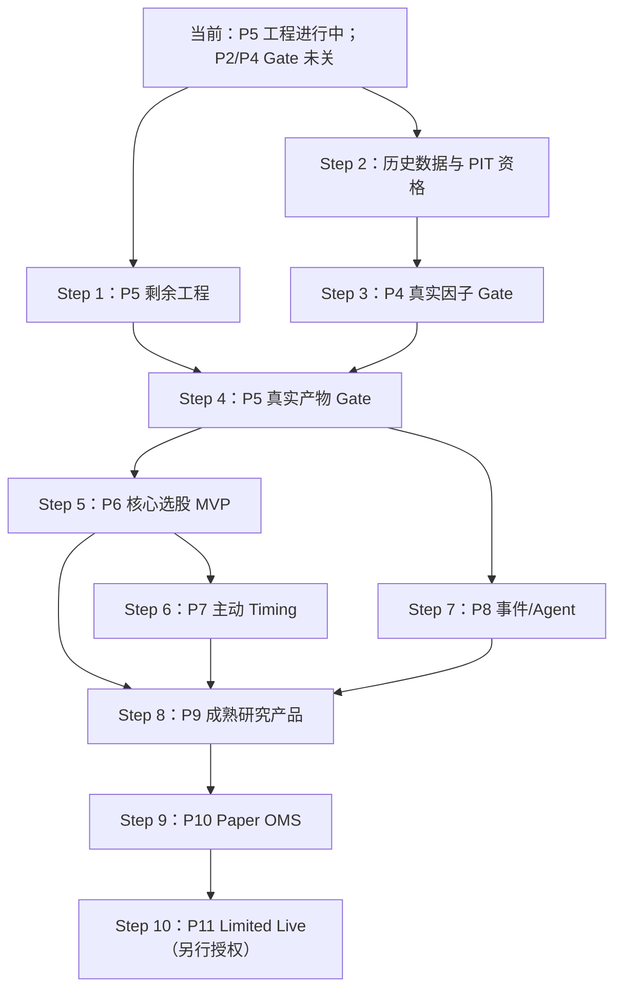

# 从当前状态到最终产品的全局交付路线图

> 状态快照：2026-08-14  
> 代码基线：`0ea1a92 feat: gate P5 investment view compilation`  
> 适用范围：当前工程状态到成熟研究产品、Paper 系统，以及可选的 Limited Live  
> 需求真源：`07-detailed-system-spec.md`  
> 工作包与 Gate 真源：`08-detailed-implementation-plan.md`  
> 产品信息架构与交互真源：`18-product-blueprint-and-prototype.md`

逐步骤实现级设计、TDD 任务、预计文件和开发前决策见
`docs/plans/README.md`；规划完整性审计见 `20-pre-development-spec-plan-audit.md`。

## 1. 先回答最重要的问题

### 1.1 现在到底开发到哪里

当前准确位置不是“P4 已全部完成、直接进入 P5”，而是：

- P4 的工程工作包 W00–W06 已实现，但真实 `pit_verified` 截面不足，P4 Capability Gate 未通过；
- P5 已实现较多领域、持久化、API 和前端能力，当前仍在 P5；
- P2 的工程底座已完成，但历史 Universe、完整行情/股本/公司行动、XBSE 和视觉证据仍有缺口；
- P3 小样本 PIT 证据链 Gate 已通过；P3.5 的 CSI500 财务扩容是 `normalized_current`，不能代替 PIT；
- P6–P11 尚未正式进入。

因此，项目的工程推进点在 **P5**，但关键依赖 Gate 仍停留在 **P2/P4**。后续必须双轨推进：一条完成 P5/P6 产品和工程能力，一条补齐真实 PIT 数据并关闭 P2/P4/P5 的真实产物 Gate。

### 1.2 P5–P11 还要不要开发

要，但目标不同：

| 阶段 | 是否需要 | 完成后得到什么 |
|---|---|---|
| P5 | 必须 | 公司四问、估值/改善、InvestmentView、审批输入和 SignalSnapshot |
| P6 | 必须 | 第一条可用的核心选股产品：组合构建、风险、现实 A 股回测、核心归因 |
| P7 | 六问产品必须 | 主动 Timing Lab、不可回填的 Shadow Forecast 和晋级门 |
| P8 | 六问产品必须 | 新闻/公告/研报、事件 Agent、供应链和事件增强 InvestmentView |
| P9 | 成熟研究产品必须 | 统一监控、归因、审批、Incident 和学习闭环 |
| P10 | Paper 产品必须 | 模拟 OMS、订单生命周期、对账、恢复和执行工作区 |
| P11 | 可选且需另行授权 | 只在用户明确授权后接入受限真实账户和最小实盘 |

如果“最终产品”指完整的 31 页原型对应运行时产品，需完成 **P5–P10**。P11 不是把页面画完整的前提，而是把已验证的 Paper 执行链升级为受限真实执行；本路线图和当前用户授权均不允许真实下单。

### 1.3 原型画完意味着什么

Figma 已完成 1440 桌面产品蓝图和黄金路径，解决的是“每个页面有什么、如何跳转、失败时显示什么”。它不是运行时代码、真实数据、服务端 Gate 或科学有效性证据。

运行时前端仍需按阶段实现真实 API 接线：

```text
Figma 产品合同
→ 领域与应用合同
→ PostgreSQL/对象存储/Parquet
→ FastAPI
→ React 页面与六态
→ 320/768/1024/1440 浏览器验收
→ Capability Gate
```

页面即使视觉完全一致，也只能展示数据库中真实存在且符合当前用途的数据；没有 PIT、审批或模型产物时必须显示 `blocked/unavailable/empty`，不得装入运行时假数据。

## 2. 什么叫“最终产品”

项目存在四个有实际意义的完成线，不能只用一个模糊的“100%”表示：

| 完成线 | 对应阶段 | 用户在浏览器中看到的成果 | 不代表什么 |
|---|---|---|---|
| 核心研究 MVP | P6 | Screen → Security → InvestmentView → Portfolio → Realistic Backtest → Risk → Core Attribution 完整闭环 | 不含成熟 Timing、事件 Agent、统一运营监控 |
| 成熟研究产品 | P9 | 31 页蓝图中的研究、因子、组合、事件、Timing、监控、数据治理和审批形成完整日常工作流 | Paper 专属执行和完整交易职责分离留到 P10 |
| Paper-ready 产品 | P10 | 模拟订单、成交、持仓、现金、对账、Incident、恢复和 kill switch 全部闭环 | 不代表获准实盘 |
| Limited Live | P11 | 人工批准的最小真实执行和只读对账逐级开放 | 不代表模型盈利或允许无人值守交易 |

建议把 **P9 定义为“研究产品完成”**，把 **P10 定义为“可长期运行的完整非实盘产品完成”**。P11 单独作为未来上线项目管理。

## 3. 当前阶段审计

| 阶段 | 当前判断 | 已有证据 | 仍缺什么 |
|---|---|---|---|
| P0 | 核心合同已实现；文档 Gate 状态有冲突 | DataMode/DeploymentStage、RunContext、四态、residual、测试和提交 | Plan 仍标 `in_progress` 并列有未勾选合同项，需单独对齐 |
| P1 | Capability Gate 已通过 | 工程骨架、账本、权限骨架、六项 Shell、响应式合同、API | 后续阶段继续扩充真实业务 API，不重做底座 |
| P2 | 工程能力较完整，Gate 未通过 | CSI800 当前身份、CSI500 当前 Universe、provider/sink/质量/血缘链路 | 2018+ 历史 Universe、全范围行情、股本、公司行动、XBSE、视觉证据 |
| P3 | 小样本 Capability Gate 已通过 | 官方 PDF、修订链、双时间事实、诊断页面、Timing baseline ledger | 不等于全市场 PIT 财务覆盖或主动 Timing |
| P3.5 | CSI500 current 财务扩容完成 | 500 家、2018–2025 年末、35,505 条 observation | 数据仍是 `normalized_current`；CSI300 去重扩容和 PIT 治理未完成 |
| P4 | W00–W06 工程能力完成，Gate 未通过 | 三类 baseline、统计交叉验证、Experiment/Reviewer、Qlib exchange、Workspace | 合格 PIT 截面、forward label、真实 IC/RankIC/样本外结果和 Promotion 产物 |
| P5 | `in_progress`，Gate 未通过 | View/Signal 合同和账本、研究 API/UI、frozen bundle 资格链、strict compilation gate | 完整估值/改善服务、真实 bundle/View/Snapshot、outcome worker、Frozen Artifact、响应式验收 |
| P6–P11 | `not_started` | 只有 Spec、Plan 和 Figma 产品合同 | 按本路线图逐阶段实现 |

### 已知文档状态冲突

`README.md` 当前写 P0 Capability Gate 已通过，但 `08-detailed-implementation-plan.md` 的 P0 标题仍为 `in_progress`，并保留若干未完成项。本路线图不擅自裁决两者；在修改权威 Plan 状态前，应逐项核对这些合同是否已被后续 P1–P5 实现覆盖，并补齐证据或恢复未完成标记。

## 4. 从现在开始的 10 个执行步骤

从当前状态到 Paper-ready 产品共有 **9 个必做步骤**；若把 Limited Live 也计入，则为 **10 个步骤**。P7 与 P8 在依赖具备后可以并行，因此实际排期不需要完全串行。

### Step 1：完成 P5 剩余工程能力

目标：先把不依赖伪造 PIT 的 P5 合同和失败关闭路径做完整。

交付：

- Frozen InvestmentView Artifact 的确定性导出、hash、对象存储、Artifact 和 lineage；
- outcome 到期 worker，以及明确的入场/退出 session、价格参考、复权和公司行动政策；
- 行业适用估值、同业相对估值、基本面锚定估值、隐含增长/利润率、趋势/加速度和一次性调整服务；
- 分析师修正仅在数据源用途资格通过时接 adapter；
- Security、Screen、InvestmentView、Alpha Model、Reviewer 的真实 API 和六态页面；
- 320/768/1024/1440 响应式实现、前端测试和浏览器证据；
- 当前真实库不合格时继续显示 blocker，保持 View/Snapshot 为 0。

验收：P5 工程路径可对 qualified input 成功、对当前不合格库稳定失败关闭；不得用测试 fixture 冒充真实 P5 产物。

### Step 2：补齐 P2/P3.5 的历史数据与 PIT 资格

目标：消除 P4/P5 真实产物的根本数据阻断。

交付：

- 2018 至今 CSI300/CSI500 历史 Universe 和成分变更有效区间；
- CSI800 去重后的 Security/Listing/Industry 主数据；
- 原始不复权行情、交易日历、停牌/涨跌停/ST/退市状态；
- 总股本、流通股本、自由流通股本和版本化市值；
- 分红、送转、拆股、配股等公司行动；
- XBSE 覆盖和沪深北代码/挂牌边界；
- 财务三表首次披露、修订、`available_at`、原始证据 hash 和 DatasetVersion；
- versioned comparable、行业分类 lineage 和 forward-return labels；
- ODS/evidence → observation → canonical → research → serving 的分层质量、血缘和覆盖率。

硬边界：现有同花顺、BaoStock、AkShare、Futu 或其他 current 数据可以用于私人本地 `normalized_current` 研究，但只有能证明当时可知时间、修订和来源资格的数据才能进入 `pit_verified`。不得通过给 current 数据补一个时间戳来伪造 PIT。

验收：可以在多个历史决策日重建“当时有哪些证券、当时已知哪版财务、下一交易日是否可交易”，且严重质量错误阻断下游。

### Step 3：关闭 P4 Capability Gate

目标：用真实合格 PIT 截面运行三类因子，而不是只证明代码会拒绝坏数据。

交付：

- 质量、估值预期差、改善三类因子的真实 PIT 截面；
- 行业/市值中性化、IC/RankIC、HAC/bootstrap、分层收益、单调性、衰减和换手；
- walk-forward、真实样本外、多重检验和研究族登记；
- 独立统计库交叉验证；
- 失败或成功的不可变 Experiment/Validation/Artifact；
- Reviewer 按用途批准、拒绝或要求修改；科学失败的 FactorVersion 保持未晋级。

验收：Capability Gate 证明研究流程正确保存真实结果。某个因子可以科学失败；失败不阻塞平台阶段完成，但绝不能进入 SignalSnapshot。

### Step 4：生成真实 P5 冻结产物并关闭 P5 Gate

目标：在 Step 2/3 之后产生第一条合法真实决策链。

交付：

- 一个真实决策日的 qualified frozen valuation bundle；
- exact factor/model/dataset/definition/bundle binding；
- 20/60/120 日 InvestmentView、分布、downside、四分项、residual、催化剂和失效条件；
- 用途审批后的 immutable SignalSnapshot；
- Frozen Artifact 和完整 lineage；
- 到期 Outcome 只能追加、不能事后改写；
- 浏览器可从 Screen 进入 Security、InvestmentView、Evidence、Reviewer 和 Alpha Model。

验收：P5 Capability Gate 通过；这仍不证明预期收益模型科学有效，只证明合法输入能生成可追溯对象，不合法输入会被拒绝。

### Step 5：完成 P6 Core Selection Golden Path

目标：得到第一版真正可使用的基本面选股研究 MVP。

交付：

- PortfolioPolicy、Top-N 等权和 score/expected-return 权重基线；
- 现金、单股、行业、换手、参与率和 prior portfolio 约束；
- Risk Model R0：industry/Size/Beta、收缩协方差、specific/total/component risk；
- 现实 A 股回测：next tradable session、T+1、整手、停牌、涨跌停、ST/退市、费用、滑点、公司行动和现金；
- RQAlpha 或 LEAN 外部引擎对照及逐笔/逐日差异解释；
- return/risk/drawdown/capacity 和 core attribution 闭合；
- Construction、Backtests、Risk、Scenarios、Attribution 运行时页面。

验收：Screen → InvestmentView → SignalSnapshot → Portfolio → Realistic Backtest → Risk → Core Attribution 完整跑通。此时浏览器第一次出现连贯的核心研究产品，但还不是完整六问系统。

### Step 6：完成 P7 主动 Timing Lab

目标：实现真正的主动市场预测，不把波动率控仓冒充主动 Timing。

交付：

- 1/5/20/60 日收益、方向、回撤和尾部标签；
- 趋势、宽度、估值、流动性、波动、宏观和风险偏好 PIT 特征；
- static、均线、volatility target 基线和至少一个简单主动模型；
- walk-forward、校准、HAC、DM、净效用、成本后和 regime 验证；
- no edit/no backfill 的每日 Shadow Forecast、Outcome 和 drift；
- PromotionReview；未晋级时对组合影响固定为 0%；
- Timing Lab、Shadow 和 Timing Monitor 页面。

验收：主动模型能力真实存在，科学失败可被保存；只有独立 Promotion Gate 通过后才允许有限非零影响。

### Step 7：完成 P8 新闻、事件 Agent 和供应链

目标：补齐“新事件改变了什么”，并把 `daily_stock_analysis` 的新闻/任务/报告经验迁入受治理链路。

交付：

- 公告、新闻、RSS、研报 adapters 和原文版本/hash；
- published/fetched/available 时间、实体链接、去重、事件聚类、纠错和来源可靠性；
- Agent model/prompt/tool/schema 版本、allowlist、预算、引用验证和完整审计；
- EventFact、EventClaim、ImpactHypothesis，区分事实/推断/观点/传闻；
- 有有效期和证据的供应链图；
- Event Study、Shadow event forecast 和多重检验；
- 新版本 InvestmentView，把 event 从 `unavailable` 转为合法状态时重新闭合和审批；
- Events、Cases、供应链、报告和通知页面。

验收：任何事件影响都能回答来源、可知时间、影响路径、期限和反证；无引用 Agent 输出不能改变 InvestmentView。P8 可在 P6/P7 部分工作进行时并行，但 P9 必须等待 P7/P8 输出合同稳定。

### Step 8：完成 P9 成熟研究产品闭环

目标：把分散的研究页面变成可以日常运营的成熟产品。

交付：

- selection/timing/event/industry/style/cost 的每日与累计统一归因；
- forecast vs realized、模型和组合归因、residual 阈值；
- 数据覆盖/新鲜度、PSI、IC、校准、容量、成本、Agent 引用和 SLO 监控；
- Alert、Incident、owner、runbook、缓解、恢复和复盘状态机；
- Factor/Alpha/Timing/Risk/Portfolio 统一用途审批；
- 用户、授权、职责分离、证据包、回滚、暂停和退役；
- Desk、Monitoring、Correlation、Production、Watchlists/Cases、Approvals 等最终产品页。

验收：研究、Shadow 和组合范围的日常运营、统一归因、审批和回滚可审计。完成 P9 后，可把产品称为“成熟研究平台”，但仍没有真实账户和真实下单。

### Step 9：完成 P10 Paper OMS

目标：在不连接真实账户的前提下验证完整执行链。

交付：

- OrderIntent/Order/Fill/Position/Cash 合法状态机和幂等；
- pre-trade risk、审批、cancel/replace、T+1 inventory 和 recovery/replay；
- Paper broker clock、ack/reject/partial fill、fee/slippage 和事件日志；
- target/order/fill/position/cash 对账和 breaks queue；
- implementation shortfall 和 daily statement Artifact；
- Paper Execution UI、PM/Trader/Admin 服务端 RBAC 和职责分离；
- 重启、重复消息、provider outage、延迟成交、日切、备份恢复和 kill switch 演练；
- Paper execution 并入统一归因并闭合。

验收：连续运行和日终对账通过，故障注入可恢复，研究服务和 Agent 无法下单。完成 P10 后，31 页原型对应的非实盘产品应具备完整运行时实现。

### Step 10：P11 Limited Live（可选、单独立项）

前提：用户未来另行明确授权真实券商、账户、标的、金额和操作范围；当前授权不包含此步骤的执行。

顺序：

```text
Shadow
→ Paper
→ Read-only broker reconciliation
→ Human-approved minimal live
→ Limited automation under policy
```

交付包括券商与许可 ADR、secret manager、2FA/unlock、真实时钟、preview、逐单/单日限额、重复防护、对账、告警、值班、kill switch 和回退。任何 Agent 都不能直接拥有交易权限。

验收：P10 长期稳定、安全审查通过、只读对账先通过、最小订单逐笔人工批准。即便 Gate 通过，也不能据此声称策略盈利。

## 5. 依赖关系与推荐并行方式



推荐安排：

- 近期并行：P5 工程收口与 P2/PIT 数据治理；
- 数据合格后：先关闭 P4，再产生真实 P5 View/Snapshot；
- P5 Gate 后：P6 与 P8 可部分并行，P6 完成后启动 P7；
- P7/P8 都稳定后汇合到 P9；
- P10 必须在 P9 治理闭环后开始；
- P11 不进入当前自动开发计划。

## 6. 浏览器里程碑

| 时点 | 浏览器里能看到什么 | 是否等于完整产品 |
|---|---|---|
| 现在 | 六项 Shell、真实数据治理页、P4 失败实验、P5 Research 部分接线和诚实 blocker | 否，仍是技术验证壳与部分产品页 |
| Step 1 后 | P5 页面视觉和交互基本按原型落地，缺 PIT 时完整展示失败原因 | 否，工程完整不等于真实产物完整 |
| Step 4 后 | 有首条真实合格 Screen/Security/View/Approval/SignalSnapshot 链 | P5 产品切片完整 |
| Step 5 后 | 可在浏览器走完核心选股、组合、现实回测、风险和核心归因 | 第一版核心研究 MVP |
| Step 8 后 | 六工作区中的研究、因子、组合、事件、Timing、监控和治理工作流完整 | 成熟研究产品；Paper 专属页面仍待 P10 |
| Step 9 后 | 加上完整 Paper execution、对账和恢复 | 完整非实盘产品 |
| Step 10 后 | 仅在明确授权下开放最小受限实盘 | 可选上线阶段 |

用户最早能看到“像一个完整产品而不是工程状态页”的关键节点是 **Step 5 / P6**；要看到 Figma 31 页对应的成熟前后端整体，应以 **Step 8 / P9** 为研究产品验收点、以 **Step 9 / P10** 为完整非实盘产品验收点。

## 7. 粗略工作量，不作为承诺日期

以下以当前代码基础、持续 TDD 和可并行开发为前提；数据采购/许可、供应商稳定性、科学结果失败和外部引擎适配会改变时间：

| 范围 | 粗略量级 | 最大不确定性 |
|---|---:|---|
| Step 1 P5 工程收口 | 1–3 周 | outcome 价格政策、估值模型边界、响应式页面量 |
| Step 2 数据/PIT | 3–10+ 周 | 真 PIT 来源、历史成分/修订覆盖、许可和限流 |
| Step 3–4 P4/P5 真实 Gate | 2–5 周 | 数据质量、样本外结果和审查迭代 |
| Step 5 P6 | 4–8 周 | A 股交易规则、双引擎 reconciliation、风险闭合 |
| Step 6 P7 | 4–8 周 | 宏观 PIT、overlap 统计、前瞻 Shadow 积累 |
| Step 7 P8 | 5–10 周 | 文档版权、实体/事件质量、Agent 引用和供应链 |
| Step 8 P9 | 4–7 周 | 全链路归因、监控 SLO、权限和 Incident 演练 |
| Step 9 P10 | 4–8 周开发 + soak | 执行状态机、故障恢复、持续运行期 |
| Step 10 P11 | 暂不估算 | 必须先取得新授权、券商和安全/法律决策 |

这些周期可以通过并行工作缩短日历时间，但不能通过减少 PIT、独立验证、审批、恢复或浏览器验收来缩短 Gate。

## 8. 每一步统一完成定义

所有 Step 均执行同一 TDD 和证据顺序：

1. 写领域/API/前端验收测试或明确缺口证据；
2. 先观察失败；
3. 最小实现，不降低 Spec；
4. 运行定向单元和集成测试；
5. 运行全量后端测试、Ruff、mypy、compileall、前端测试/lint/build；
6. 有真实数据链时做数据库和真实小样本验证；
7. 有前端改动时做 320/768/1024/1440 浏览器验收；
8. 更新实现证据、限制和 Gate 结论；
9. 独立提交和推送仅在用户授权范围内执行；
10. 测试通过只说明合同按预期工作，绝不自动声明模型科学有效。

## 9. 近期执行队列

按当前工作树和依赖，下一批建议顺序是：

1. 完成当前已写红测的 Frozen InvestmentView Artifact export；
2. 明确 outcome 的 session/价格/复权/公司行动政策并实现到期 worker；
3. 补 P5 估值/改善服务剩余合同；
4. 完成 P5 320/768/1024/1440 运行时前端和浏览器验收；
5. 与上述工作并行推进历史 Universe、行情、股本、公司行动、XBSE 和真实 PIT 财务；
6. 数据合格后依次重跑 P4 资格、P5 bundle、InvestmentView 和 SignalSnapshot；
7. P5 Gate 通过或工程能力完整且真实 blocker 被保存后，开始 P6。

当前工作树有一个未提交的 P5 Frozen Artifact 红测 `platform/tests/test_investment_view_artifacts.py`。它是 Step 1 的合理起点，但红测本身不是已完成功能。

## 10. 不变边界

- `sources/daily_stock_analysis` 与 `sources/legacy_quant_platform` 永远只读；
- 新代码只进入 `platform/`，权威设计和迁移记录只进入 `docs/`；
- 不修改 `/Users/macbook/agent-agnostic-stock-skills-clean`；
- `normalized_current` 永远不能冒充 `pit_verified`；
- 不为页面完整加入运行时假数据；
- 不允许 Agent 绕过审批、风险和执行 Gate；
- P11 前不连接真实账户；当前不允许真实交易、下单或撤单；
- Capability Gate、Promotion Gate、模型科学有效和获准实盘是四个不同结论。
